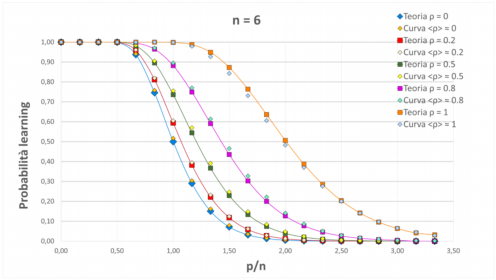

# Analisi del Perceptron e della sua espressività nella classificazione di dati strutturati

**Thesis: [Thesis](Tesi_Lazzari_Andrea_885250.pdf)**

 __" Il cambiamento è il risultato finale del vero
 apprendimento: ogni volta che impariamo qualcosa di
nuovo, noi stessi diventiamo qualcosa di nuovo "__

I successi ottenuti dal machine learning nelle applicazioni sono molti e vanno
spesso al di là della capacità di comprensione fornita dagli strumenti teorici
attuali, specialmente riguardo le reti neurali. Negli ultimi quarant’anni la fisica,
specialmente statistica, si è rivelata essere uno strumento produttivo nello studio
dei fondamenti del machine learning e ha permesso di andare oltre l’approccio
tipico della matematica basato su analisi di "worst case". Uno degli sforzi in cui è
attualmente impegnata la comunità di fisica statistica è quello di comprendere come
le specificità dei dati influenzino l’espressività delle reti neurali, con lo scopo di
incorporare questi effetti nella teoria esistente. L’obiettivo di questa tesi è elucidare
l’influenza della struttura dei dati (descritta con un modello semplice e trattabile)
sulla loro separabilità lineare, un concetto basilare in machine learning.

In questa tesi ho considerato il perceptron: una rete neurale paradigmatica, con
una struttura semplice e trattabile analiticamente, ma con una fenomenologia già
non banale. Il perceptron è un classificatore lineare, in grado cioè di dividere i dati
di input in due sottoinsiemi separati da un iperpiano. Considerato come una rete
neurale é costituito da un singolo layer di input e da un solo output di tipo binario;
esso è ampiamente utilizzato nelle applicazioni pratiche come elemento modulare
per la realizzazione di architetture più complesse.

La particolare definizione di struttura dati che ho preso in esame è quella di
input organizzati in doppietti, ovvero coppie di punti a distanza angolare fissata.
La metrica classica di espressività di una rete è la capacità $\alpha_c$ , che misura il numero
massimo di input che la rete può imparare a classificare. Una misura più dettagliata
è $C(n, p)$, il numero di dicotomie distinte di $p$ input in $n$ dimensioni che la rete (il
perceptron in questo caso) può rappresentare. Il rapporto tra $C(n, p)$ e il numero
totale di dicotomie $2^p$ si può interpretare come la probabilità di apprendimento, da
parte del perceptron, di una dicotomia tipica.
Esiste una teoria combinatoria formulata da Cover, il cui principale risultato
riguarda proprio questa grandezza, la quale soddisfa una semplice equazione di
ricorrenza:

$$C(n, p) = C(n, p − 1) + C(n − 1, p − 1)$$

Nella tesi l’obiettivo è stato quello di estendere questa teoria al caso di dati
strutturati in doppietti, cioè quando gli input sono $p$ coppie di punti in $n$ dimensioni,
la cui distanza angolare a coppie sia fissata da un parametro $\rho$. Il calcolo può essere
portato a termine in una approssimazione di campo medio, nello spirito della fisica
statistica. Il risultato è una equazione di ricorrenza piú complicata:

$$C(n, p, ρ) = \Psi_2 · C(n, p − 1, ρ) + C(n − 1, p − 1, ρ) + (1 − \Psi_2) · C(n − 2, p − 1, ρ)$$

Per verificare la bontà della teoria, ho confrontato le predizioni teoriche con
simulazioni numeriche. L’algoritmo più comunemente utilizzato in letteratura è il
\_perceptron algorithm_\, il quale però presenta alcuni problemi di convergenza. Essendo
il perceptron un separatore lineare ho pensato di implementare un algoritmo basato
su tecniche di \_linear programming_\. La programmazione lineare si occupa infatti
di studiare algoritmi di risoluzione per problemi di ottimizzazione lineare, ovvero
problemi in cui sono lineari sia la funzione obiettivo (la funzione da ottimizzare),
sia i vincoli a cui essa è soggetta, ovvero tutte le relazioni tra le variabili in gioco.
Il codice che ho realizzato sfrutta librerie scritte appositamente per questi tipi di
problemi e ho constatato che risulta significativamente più veloce del \_perceptron
algorithm_\.

Ho generato casualmente training set di dati strutturati in doppietti con diversi
valori di overlap $\rho$ e ho misurato la probabilità di apprendimento da parte del
perceptron di una data classificazione, ovvero quante delle dicotomie possibili tra
gli input generati sono linearmente separabili. Con un’analisi statistica dei dati, ho
ottenuto delle curve di apprendimento che si confrontano con i valori teorici a $n$ e $\rho$
fissati:

  

Le approssimazioni implicite nella teoria di campo medio sono irrilevanti nel
limite termodinamico, cioè per dimensioni $n$ grandi.
 In effetti ho trovato una concordanza perfetta tra teoria e simulazioni numeriche in questo regime. 
 Tuttavia anche in dimensioni ridotte la teoria dà risultati molto precisi, come mostra la figura
(dove $n = 6$). Piú in generale, questo lavoro ha mostrato che la teoria combinatoria
di Cover può essere usata fruttuosamente per studiare il ruolo della struttura dei
dati nel machine learning.

